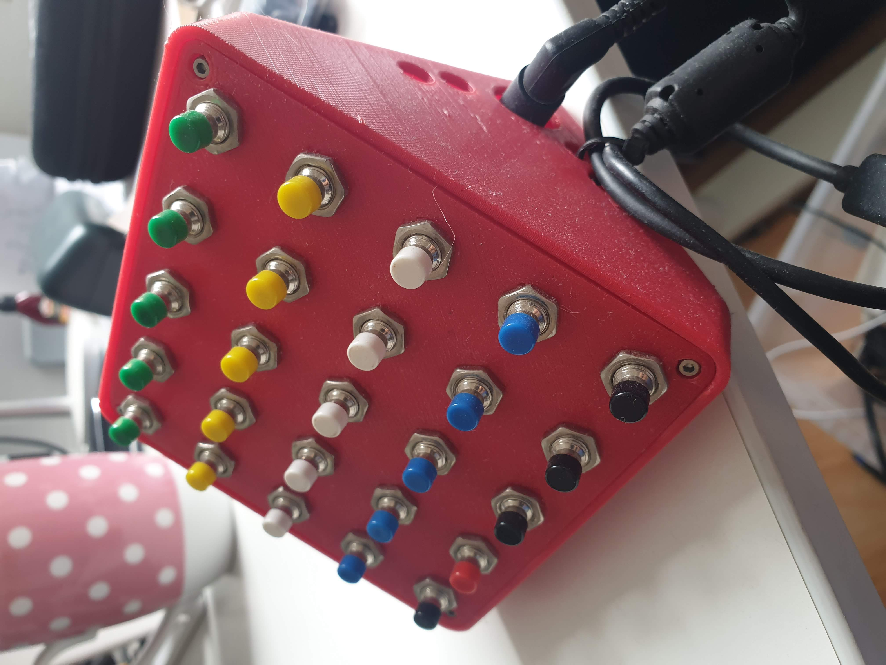
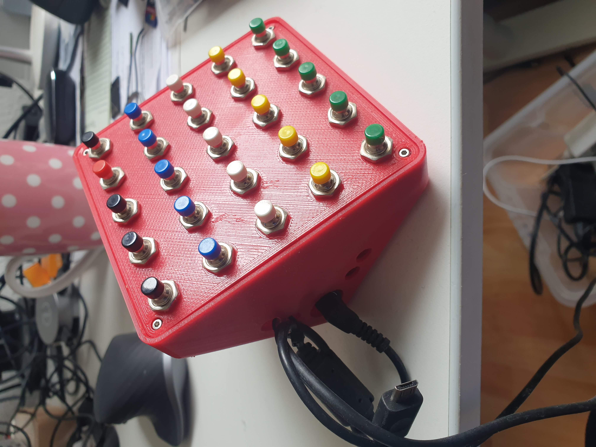
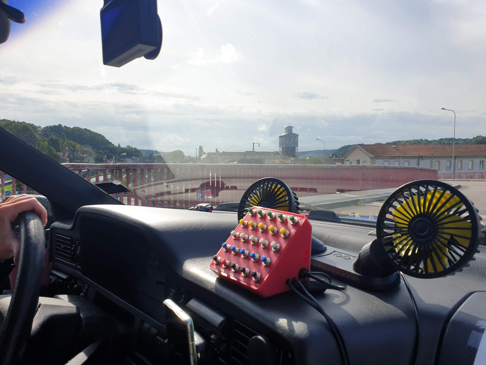
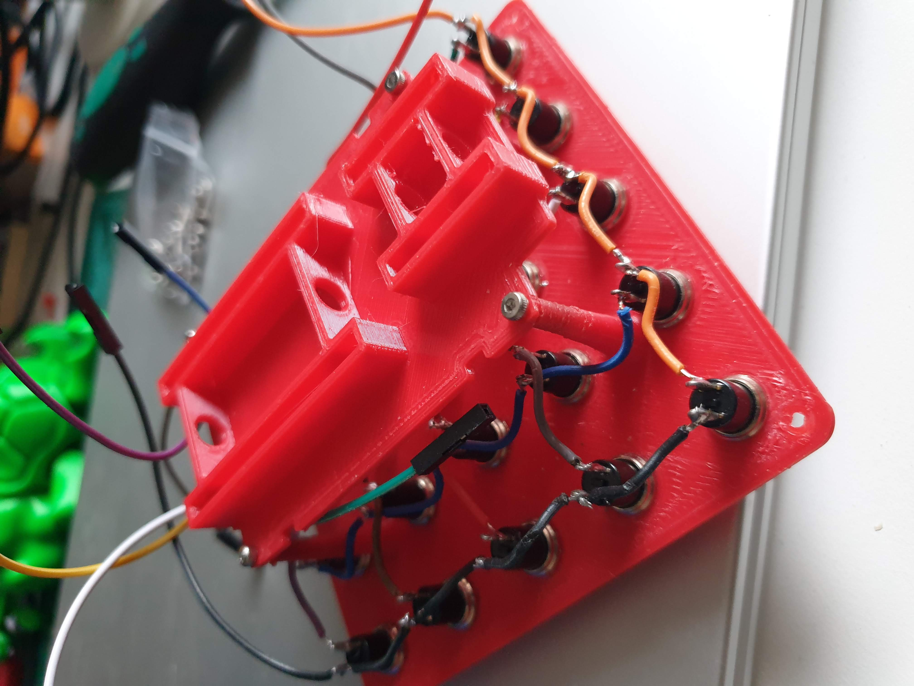
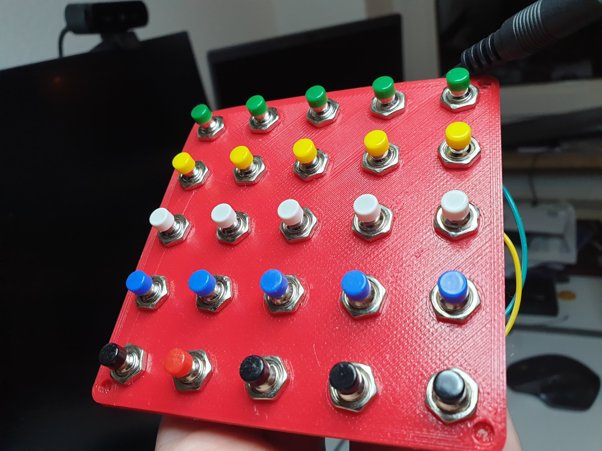
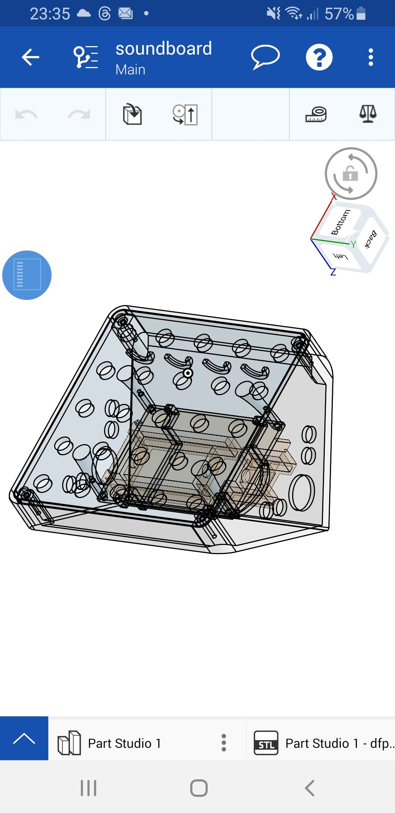
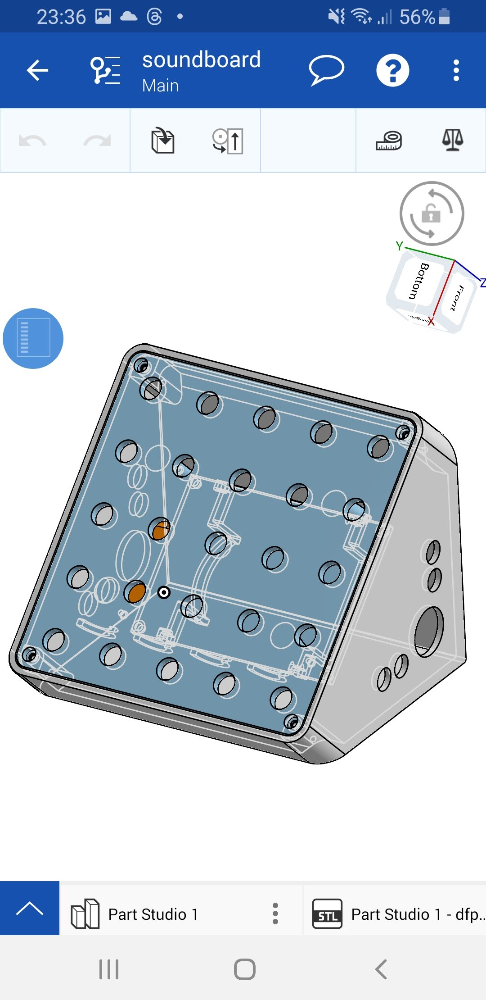
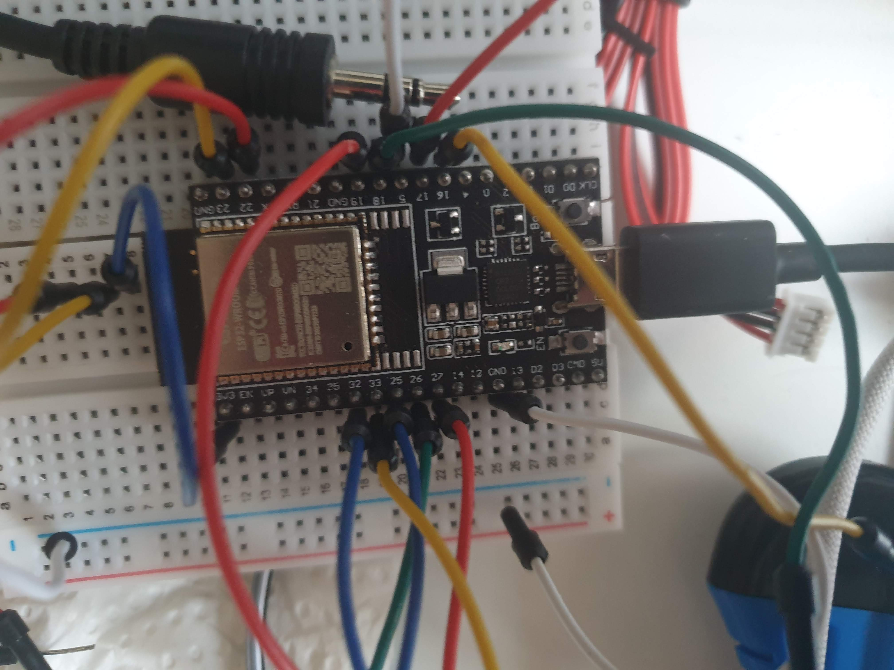
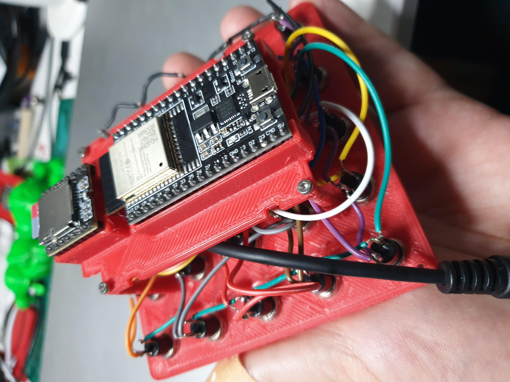
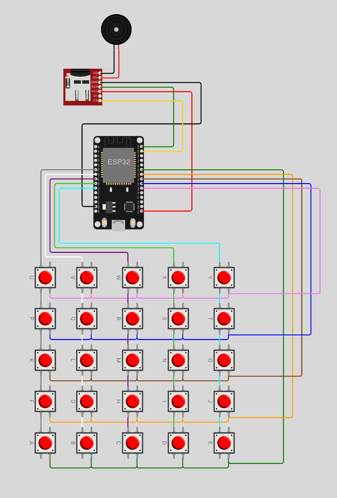

# 🚗 Soundboard für den Carbage Run

## 🎯 Motivation

Beim **Carbage Run** – einer Rallye mit Schrottautos – haben viele Teilnehmer Fanfaren, Megafone oder lustige Sounds abgespielt.  
Wir hatten zwar bereits ein Megafon mit Line-In und Bluetooth, aber:

> 🎛️ "Wenn ich hupen will, will ich auf einen Knopf hauen – nicht erst das Handy entsperren!"

Deshalb: ein eigenständiges Soundboard mit 25 Tasten, SD-Karte und Sofortreaktion.

---

## 📸 Vorschau

### Gehäuse (3D-gedruckt)









### Innenleben



### Tastenmatrix in Aktion


> Alle Bilder findest du im Ordner `docu/`

---

## ⚙️ Features

- 🎵 **25 Tasten** in 5×5 Matrix für direkte Soundauswahl
- 🔁 **Zweifachbelegung:** Shift-Modus (Taster gedrückt halten oder Bluetooth-Befehl → Track +25)
- 💾 **DFPlayer Mini** spielt MP3s direkt von SD-Karte
- 📡 **Bluetooth**-Steuerung per Smartphone-App oder Terminal
- 🧠 **ESP32** mit frei programmierbarer Logik
- 🧰 [**3D-gedrucktes Gehäuse**](https://cad.onshape.com/documents/51f835b686c64aa4e062ca5b/w/735ce97b22fc647d3e8dc544/e/93c6d67ebc2946beec692255?renderMode=0&uiState=6890fba874e54c0f2372ca89)

---

## 🧠 Schaltung

Erstellt in [Wokwi](https://wokwi.com) (Virtueller Schaltplan: `wokwi_project.json`)

### 🔘 Tastenanschlüsse

| Zeile (row) | ESP32 Pin |
|-------------|-----------|
| R1          | D19       |
| R2          | D18       |
| R3          | D5        |
| R4          | D17       |
| R5          | D16       |

| Spalte (col) | ESP32 Pin |
|--------------|-----------|
| C1           | D32       |
| C2           | D33       |
| C3           | D25       |
| C4           | D26       |
| C5           | D27       |

### 🎧 DFPlayer Mini Anschluss 
Für die korrekte Verkabelung siehe
[DFPlayer Mini Dokumentation](https://www.elektronik-kompendium.de/sites/praxis/bauteil_dfplayer-mini.htm)

| DFPlayer Pin | ESP32 Pin |
|--------------|-----------|
| TX           | GPIO22    |
| RX           | GPIO23    |
| VCC          | 5V        |
| GND          | GND       |
|----| **Endstufe**|
| SPK1     | Left Audio  |
| GND      | GND Audio   |
| SPK2     | Right Audio |


💾 SD-Karte:  
MP3-Dateien im Format `0001.mp3` bis `0050.mp3` im MP3 Verzeichnis.


---

## 📂 Projektstruktur

```text
/
├── src/
│   ├── MP3/                # Arduino-Quellcode
│   └── main.cpp
├── printfiles/         # STL-Dateien für 3D-Druck
├── docu/               # Fotos, Schaltpläne, Screenshots
└── README.md
