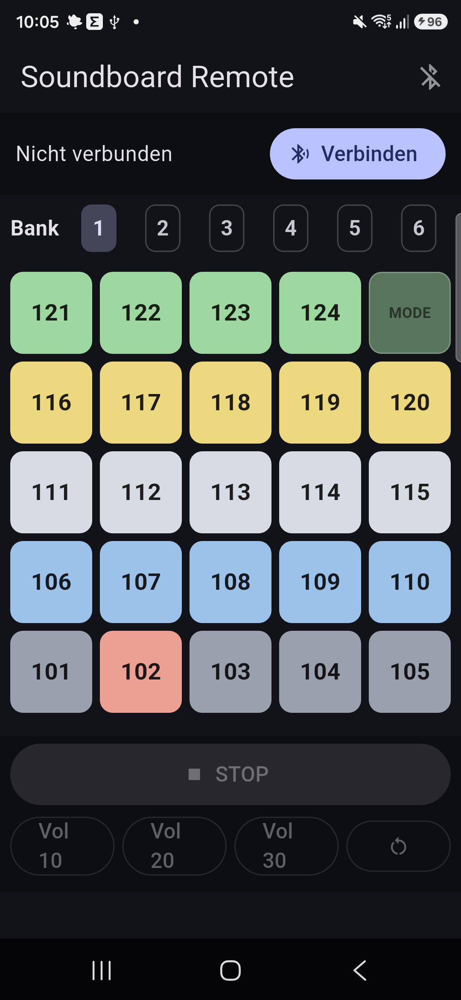

# 📱 Soundboard Remote (Flutter, Android)

Android-App zur **Fernsteuerung des ESP32-Soundboards über Bluetooth Classic (SPP)**.
Spiegelt das physische Gerät: 6 Bänke, je ein 5×5-Raster mit den echten Tastenfarben.

<p align="center">
  
</p>

## Funktion

- 🔵 **Verbinden** mit dem gekoppelten Gerät `das_11lein` (gekoppelte Geräte werden
  gelistet – vorher einmal in den Android-Bluetooth-Einstellungen koppeln).
- 🎛️ **6 Bänke** wählbar; pro Bank ein 5×5-Raster (Position unten links beginnend,
  oben rechts = Mode-Taste, nicht belegbar), eingefärbt nach der physischen
  Tastenfarbe.
- ▶️ Tippen sendet die Tracknummer **`Bank*100 + Position`** (`101`–`624`).
- 🔈 **Lautstärke** 10/20/30, ⏹ **Stop**, ↻ **Neustart** – als Befehle `9999`
  absteigend (siehe Firmware-Protokoll).

## Architektur

- `lib/soundboard_controller.dart` – Verbindungs-/Sende-Logik (`ChangeNotifier`),
  spricht über den Platform-Channel `soundboard/bt`.
- `lib/home_page.dart` – UI (Verbindungsleiste, Bank-Auswahl, Raster, Steuerung).
- `android/.../MainActivity.kt` – nativer **SPP-Channel** (BluetoothSocket via
  RFCOMM-UUID `00001101-…`). Bewusst kein Drittanbieter-BT-Plugin, damit der
  Build mit aktuellem AGP/Gradle sauber durchläuft.
- `assets/key-colors.json` – Tastenfarben (Kopie aus dem `mp3-sorter`-Tool).

Berechtigung: `BLUETOOTH_CONNECT` (Android 12+) wird zur Laufzeit über
`permission_handler` angefragt; nur gekoppelte Geräte, kein Scan/Location nötig.

## Bauen & Installieren

> ⚠️ **Wichtig:** Android-/Gradle-Builds scheitern an Leerzeichen/Klammern im Pfad.
> Dieses Repo liegt unter `…/Soundboard (Kopie)/`, daher **nicht hier direkt
> bauen**. Projekt an einen Pfad **ohne Leerzeichen** kopieren (z. B.
> `~/soundboard_remote`) und dort bauen.

Voraussetzungen: Flutter SDK, Android SDK (`platforms;android-35`,
`build-tools;35.0.0`), **JDK 17** (eine JRE reicht nicht – `javac` nötig).

```bash
cp -r app ~/soundboard_remote && cd ~/soundboard_remote
export JAVA_HOME=/pfad/zur/jdk-17
flutter pub get
flutter build apk --release        # build/app/outputs/flutter-apk/app-release.apk
# auf ein angeschlossenes Telefon:
flutter install                    # oder: adb install -r app-release.apk
```

## Protokoll (muss zur Firmware passen)

| Senden | Wirkung |
|--------|---------|
| `101`–`624` | Track abspielen (`Bank*100 + Position`) |
| `9999` | Stop |
| `9998` / `9997` / `9996` | Lautstärke 10 / 20 / 30 |
| `9995` | Neustart |

Jeweils als ASCII-Zahl mit abschließendem `\n`.
